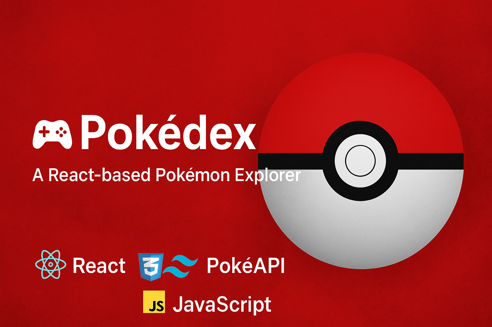
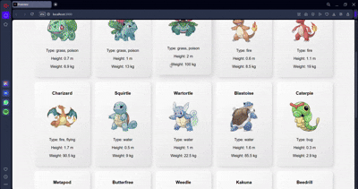
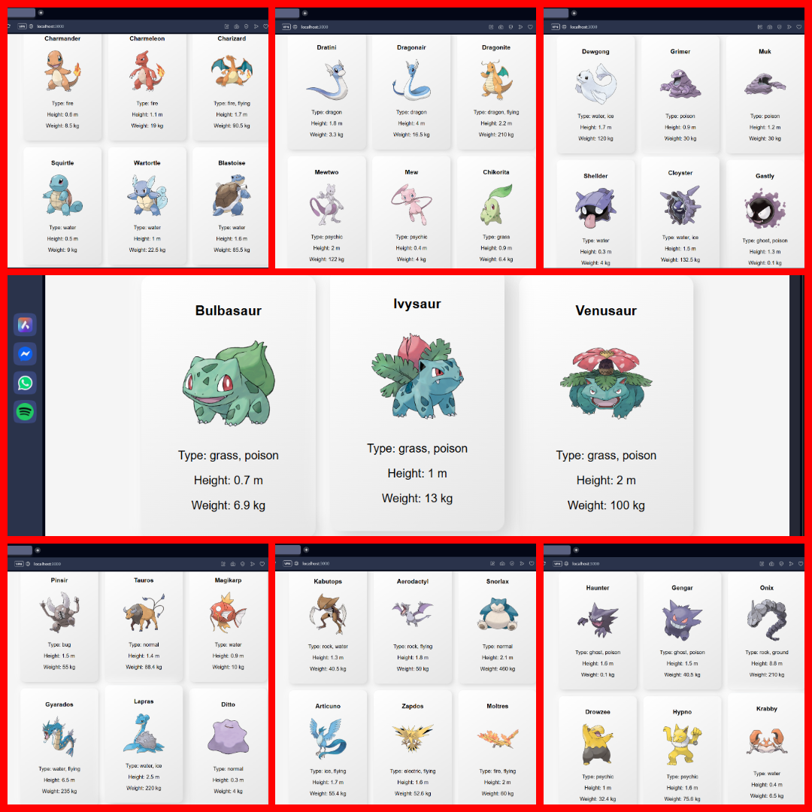

cat > README.md << 'EOF'
<!-- Banner -->
<p align="center">
  
</p>

<h1 align="center">🎮 Pokédex</h1>
<p align="center"><em>A Beautiful React-based Pokédex with Images & Animations</em></p>

<p align="center">
  
  
  
</p>

---

## 📽️ Demo  
<p align="center">
  
</p>

---

## 🧐 Features  
- 🎨 Sleek Pokéball-themed interface  
- 📸 Pokémon images with names, IDs, and types  
- 🔍 Instant search functionality  
- 🌐 Real-time data from [PokéAPI](https://pokeapi.co/)  
- 📱 Fully responsive across all devices  

---

## 🖼️ Preview  
<p align="center">
  
</p>

---

## 📁 Project Structure  

pokedex/
├── public/
│   ├── index.html
│   ├── favicon.ico
│   └── assets/
│       ├── pokedex-banner.png
│       ├── demo.gif
│       └── preview.png
│
├── src/
│   ├── components/
│   │   └── PokemonCard.js
│   ├── App.js
│   ├── App.css
│   └── index.js
│
└── README.md

---

## ⚙️ Installation  

```bash
# Clone the repository
git clone https://github.com/Abdullah-Arif-5065/pokedex.git
cd pokedex

# Install dependencies
npm install

# Start the development server
npm start

---

## 🧑‍💻 Author

Made with ❤️ by Abdullah Arif